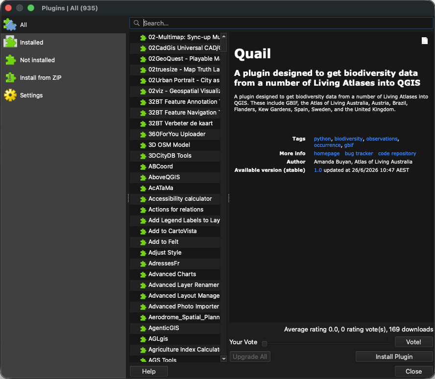
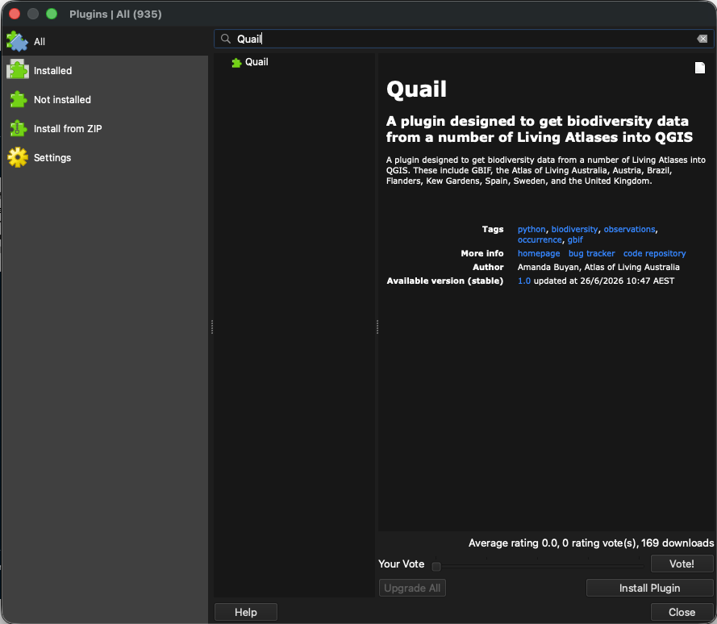
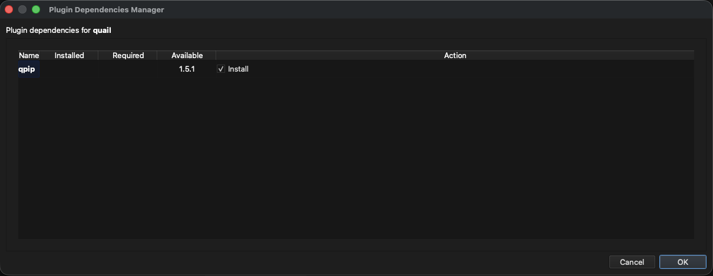
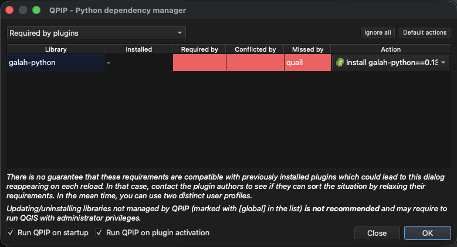

Installation
=====================================

Step 1: Install QGIS
---------------------------------------------------- 

Before installing the Quail plugin, you need to install QGIS. Download 
the latest version of QGIS from `qgis.org <https://qgis.org>`_. For Windows 
useres we strongly recommend using the Online (OSGeo4W) installer.

.. warning:: Must use QGIS version 4.0 or higher

    Quail has already migrated to the future long-term release (LTR) version 
    4+, `scheduled to be released in October 2026 <https://blog.qgis.org/2025/10/07/update-on-qgis-4-0-release-schedule-and-ltr-plans/>`_.  
    We recommend that you update your QGIs version, as loading Quail in QGIS versions 
    older than 4.0 will return the following error:

    .. figure:: images/QGIS3-error.jpg
        :scale: 65
        :align: center

Step 1: Install Quail Through Plugin Repository
----------------------------------------------------

.. note:: the images here are shown for a Mac, but this installation is the same process irrespective of your operating system.

In QGIS, navigate to the Plugins menu, and click on "Manage and Install Plugins".

|

|

Go to the "All" tab:

|

|

Search for "Quail":

|

|

Click "Install Plugin" in the lower right-hand corner.  You will see a popup window 
called "Plugin Dependency Manager" that will direct you to install a plugin called QPIP. 
Install this to make managing Quail easier in the future.

|

|

Now, QPIP will direct you to install `galah-python`, the main Python package 
that Quail uses to download data.  Click "OK" to install.

|

|

The Quail plugin is installed!  Click on the Quail logo on your toolbar to start using Quail.