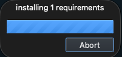

Installation
=====================================

Before installing the Quail plugin, you need to install QGIS. You can download the latest version of QGIS from `qgis.org <qgis.org>`_. 

Installing Through the QGIS Plugin Manager
---------------------------------------------------- 

In QGIS, navigate to the Plugins menu, and click on "Manage and Install Plugins".

.. figure:: images/Manage_Install.png
    :scale: 65
    :align: center

|

|

Go to the "All" tab, which looks like this:

.. figure:: images/Search_All.png
    :scale: 65
    :align: center

|

|

Search for "Quail" and it will come up in the menu like this:

.. figure:: images/Search_Quail.png
    :scale: 65
    :align: center

|

|

Click "Install Plugin" in the lower right-hand corner.  You will then get a popup window 
called "Plugin Dependency Manager", which will direct you to install a plugin called QPIP.

.. figure:: images/Plugin_Dependency.png
    :scale: 65
    :align: center

|

|

Install this, as it will make managing Quail easier in the future.

Now, QPIP will direct you to install `galah-python`, as this is the main Python package 
that Quail uses to download data.

.. figure:: images/Install_galah_python.png
    :scale: 65
    :align: center

|

|

You will get a popup like this while everything is installing:

|

|

Now the plugin is installed!  Click on the Quail logo on your toolbar.